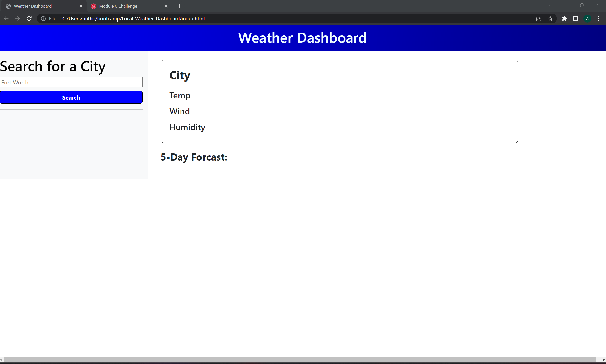
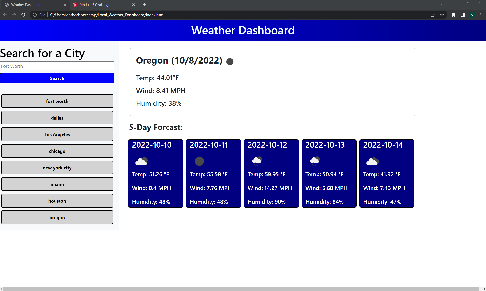

# Week6_Challege_Weather_Dashboard

## Description

This application is a weather dashboard that calls the openweather api to display the current temp as well as a five day forcast forcast for the selected city. It also stored the previous city in local storage and then creates a button for further use if needed.

User Story:

AS A traveler
I WANT to see the weather outlook for multiple cities
SO THAT I can plan a trip accordingly

Acceptance Criteria:

GIVEN a weather dashboard with form inputs
WHEN I search for a city
THEN I am presented with current and future conditions for that city and that city is added to the search history
WHEN I view current weather conditions for that city
THEN I am presented with the city name, the date, an icon representation of weather conditions, the temperature, the humidity, and the the wind speed
WHEN I view future weather conditions for that city
THEN I am presented with a 5-day forecast that displays the date, an icon representation of weather conditions, the temperature, the wind speed, and the humidity
WHEN I click on a city in the search history
THEN I am again presented with current and future conditions for that city

## Installation

Website Url: https://a-speece.github.io/Local_Weather_Dashboard/ GitHub Repo:https://github.com/A-Speece/Local_Weather_Dashboard.git

## Screenshot

